<div align="center">

<a href="https://audiocn.dev">
  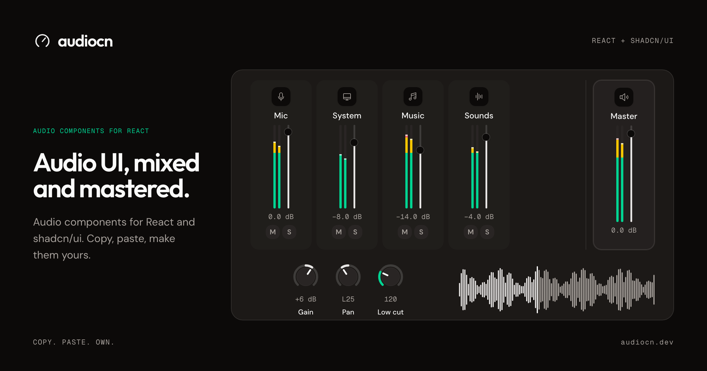
</a>

<p><strong>Audio components for React, built the shadcn way.</strong><br />
Level meters, visualizers, faders, knobs, channel strips, a complete mixer, players and sound pads.<br />
Copy, paste, make them yours.</p>

<p>
  <a href="https://audiocn.dev/docs/components"></a>
  <a href="https://audiocn.dev/docs/blocks"></a>
  <a href="https://audiocn.dev/docs/hooks/use-audio-analyser"></a>
  <a href="./license.md"></a>
</p>

<p>
  <a href="https://react.dev"></a>
  <a href="https://ui.shadcn.com/docs/registry"></a>
  <a href="https://tailwindcss.com"></a>
  <a href="https://base-ui.com"></a>
  <a href="https://developer.mozilla.org/docs/Web/API/Web_Audio_API"></a>
</p>

<p>
  <a href="https://audiocn.dev/docs"><strong>Docs</strong></a> ·
  <a href="https://audiocn.dev/docs/installation"><strong>Installation</strong></a> ·
  <a href="https://audiocn.dev/docs/components"><strong>Components</strong></a> ·
  <a href="https://audiocn.dev/docs/blocks"><strong>Blocks</strong></a> ·
  <a href="https://audiocn.dev/docs/concepts/theming"><strong>Theming</strong></a>
</p>

</div>

## Why audiocn

- **You own the code.** It is not a package. Like shadcn/ui, every component is copied into your project with the shadcn CLI, so you can change anything.
- **Themed by shadcn.** Built on [Base UI](https://base-ui.com), styled with Tailwind CSS and themed with the same CSS variables as shadcn/ui. Any shadcn theme restyles audiocn.
- **Fast by default.** Meters and visualizers paint on the animation frame without re-rendering React, so a mixer with many channels stays smooth.
- **Bring your own audio.** Components receive levels and values; they never open a microphone themselves. Use the included Web Audio hooks, or feed them from any other engine.
- **Real units.** Mixer components speak decibels, the way audio engineers do.
- **Accessible.** Keyboard control on every fader, knob and strip, real ARIA roles and reduced-motion support.

## Components

<table>
  <tr>
    <td width="50%"><a href="https://audiocn.dev/docs/components/mixer">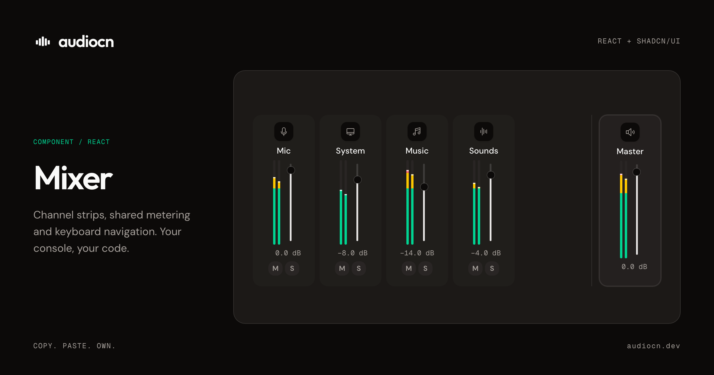</a></td>
    <td width="50%"><a href="https://audiocn.dev/docs/components/level-meter">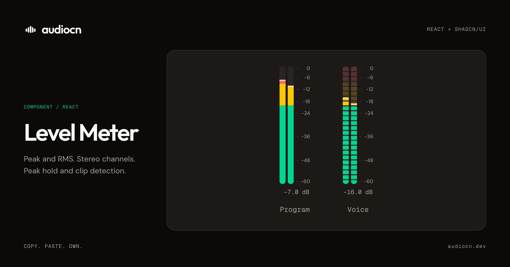</a></td>
  </tr>
  <tr>
    <td width="50%"><a href="https://audiocn.dev/docs/components/knob">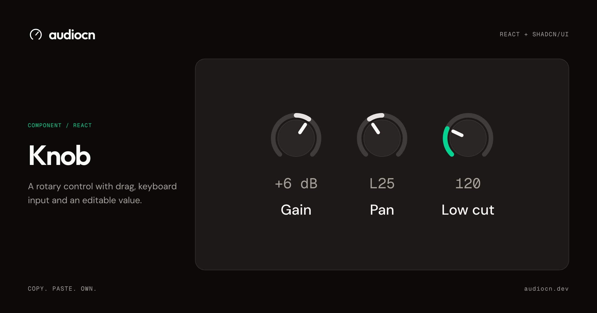</a></td>
    <td width="50%"><a href="https://audiocn.dev/docs/components/waveform">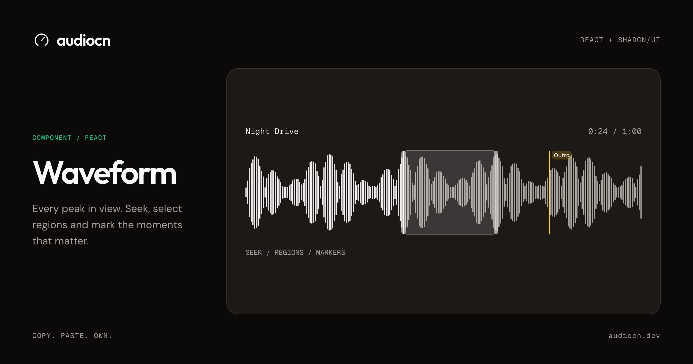</a></td>
  </tr>
  <tr>
    <td width="50%"><a href="https://audiocn.dev/docs/components/electric-waveform">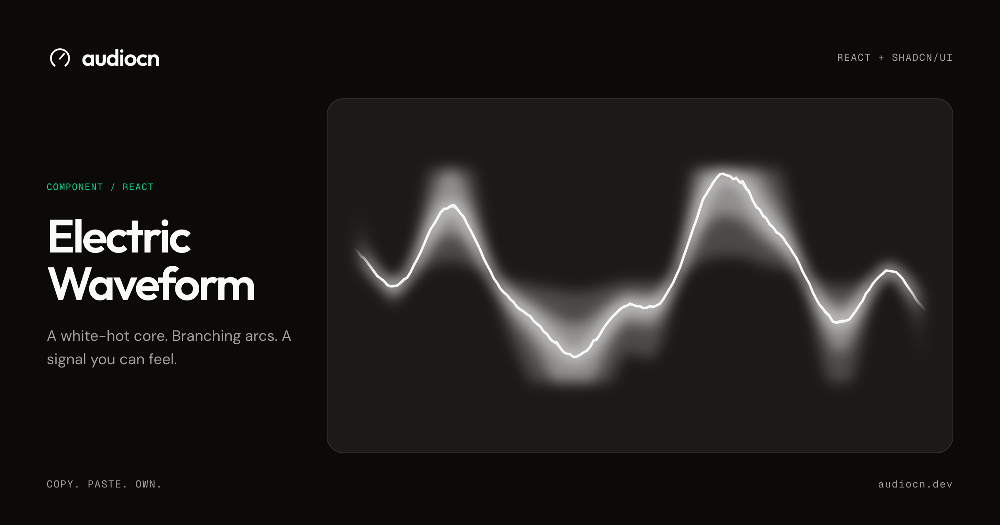</a></td>
    <td width="50%"><a href="https://audiocn.dev/docs/components/electric-bar-visualizer">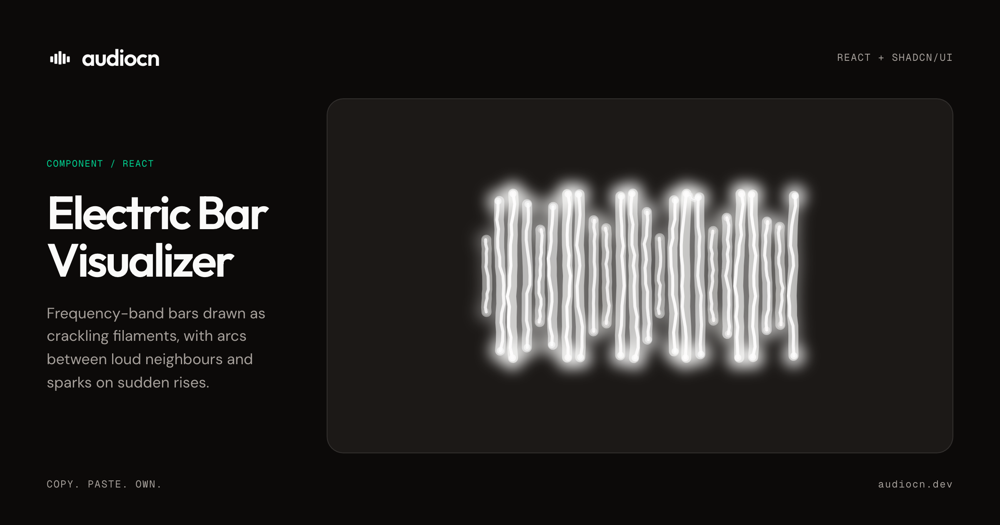</a></td>
  </tr>
  <tr>
    <td width="50%"><a href="https://audiocn.dev/docs/components/spectrum">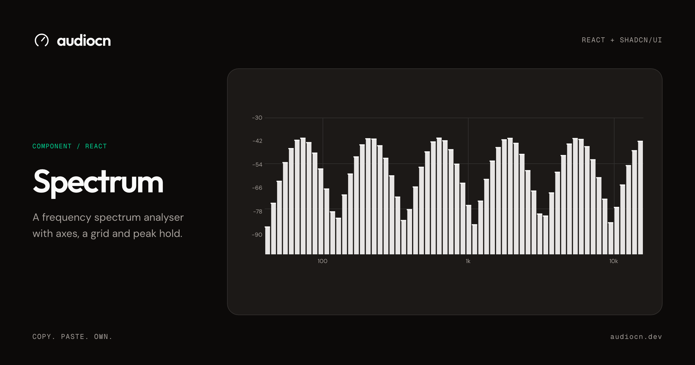</a></td>
    <td width="50%"><a href="https://audiocn.dev/docs/components/smooth-waveform">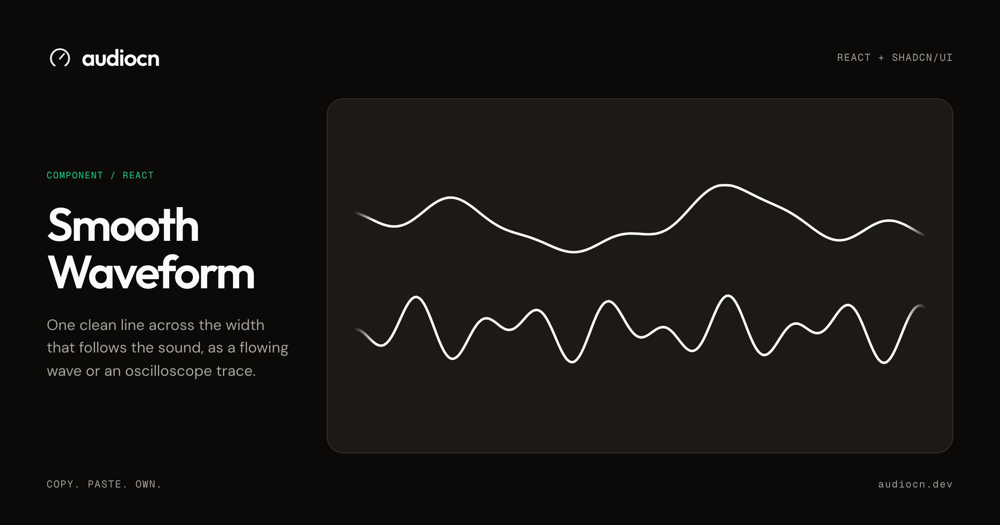</a></td>
  </tr>
  <tr>
    <td width="50%"><a href="https://audiocn.dev/docs/components/audio-player">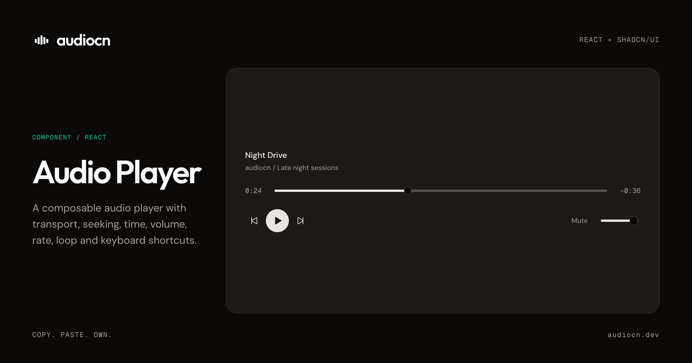</a></td>
    <td width="50%"><a href="https://audiocn.dev/docs/components/sound-pad">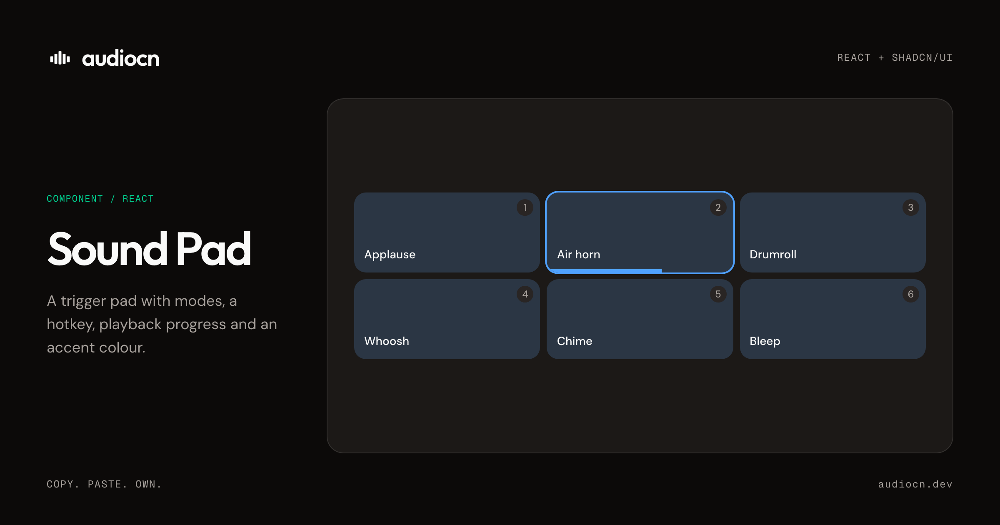</a></td>
  </tr>
</table>

<details>
<summary><strong>All 23 components</strong></summary>

<br />

**Meters and visualizers**

| Component | What it does |
| --- | --- |
| [Level Meter](https://audiocn.dev/docs/components/level-meter) | Peak and RMS meter with zones, peak hold, a scale, a readout and a clip light |
| [dB Scale](https://audiocn.dev/docs/components/db-scale) | Tick marks and labels for a decibel range, shared by meters and faders |
| [dB Readout](https://audiocn.dev/docs/components/db-readout) | A numeric level label that updates at a readable rate and never shifts the layout |
| [Clip Indicator](https://audiocn.dev/docs/components/clip-indicator) | A clip light that holds after the signal clips, with a count and click to reset |
| [Bar Visualizer](https://audiocn.dev/docs/components/bar-visualizer) | Bars driven by frequency bands, with idle, loading and mirrored modes |
| [Electric Bar Visualizer](https://audiocn.dev/docs/components/electric-bar-visualizer) | Bars as crackling filaments, with arcs between loud neighbours and sparks |
| [Electric Waveform](https://audiocn.dev/docs/components/electric-waveform) | One electric line with a white-hot core, a tall glow, forks and sparks |
| [Smooth Waveform](https://audiocn.dev/docs/components/smooth-waveform) | A clean line that follows the sound, as a flowing wave or an oscilloscope trace |
| [Live Waveform](https://audiocn.dev/docs/components/live-waveform) | A canvas waveform of a live signal, as scrolling history or the current frame |
| [Waveform](https://audiocn.dev/docs/components/waveform) | A clip's waveform with a playhead, seeking, hover time, regions and markers |
| [Spectrum](https://audiocn.dev/docs/components/spectrum) | A frequency spectrum analyser with axes, a grid and peak hold |

**Controls**

| Component | What it does |
| --- | --- |
| [Fader](https://audiocn.dev/docs/components/fader) | A volume fader in decibels, with tapers, detents, a scale, reset and an editable value |
| [Parameter Slider](https://audiocn.dev/docs/components/parameter-slider) | A labelled slider with a numeric input, unit, marks and reset |
| [Knob](https://audiocn.dev/docs/components/knob) | A rotary control for dense layouts, drawn in SVG |
| [Pan Control](https://audiocn.dev/docs/components/pan-control) | Left and right balance with a fill from the centre and a centre detent |
| [Channel Toggle](https://audiocn.dev/docs/components/channel-toggle) | Mute, solo and monitor buttons with their own pressed colours |
| [Volume Control](https://audiocn.dev/docs/components/volume-control) | A simple volume slider with a mute button, for players |
| [Audio Device Select](https://audiocn.dev/docs/components/audio-device-select) | A microphone, speaker or source picker with permission and disconnected states |

**Mixer**

| Component | What it does |
| --- | --- |
| [Channel Strip](https://audiocn.dev/docs/components/channel-strip) | One mixer channel, as a row or a console strip, composed from the parts you need |
| [Mixer](https://audiocn.dev/docs/components/mixer) | The container for channel strips, with shared meter settings and keyboard navigation |

**Sounds and music**

| Component | What it does |
| --- | --- |
| [Audio Player](https://audiocn.dev/docs/components/audio-player) | A composable player with transport, seeking, time, volume, rate, loop and shortcuts |
| [Track List](https://audiocn.dev/docs/components/track-list) | Tracks with active and playing states and arrow-key navigation |
| [Sound Pad](https://audiocn.dev/docs/components/sound-pad) | A trigger pad with modes, a hotkey, playback progress and an accent colour |

</details>

## Blocks

Complete, working audio features composed from the components. Drop one in and ship.

<table>
  <tr>
    <td width="50%"><a href="https://audiocn.dev/docs/blocks/system-audio-mixer">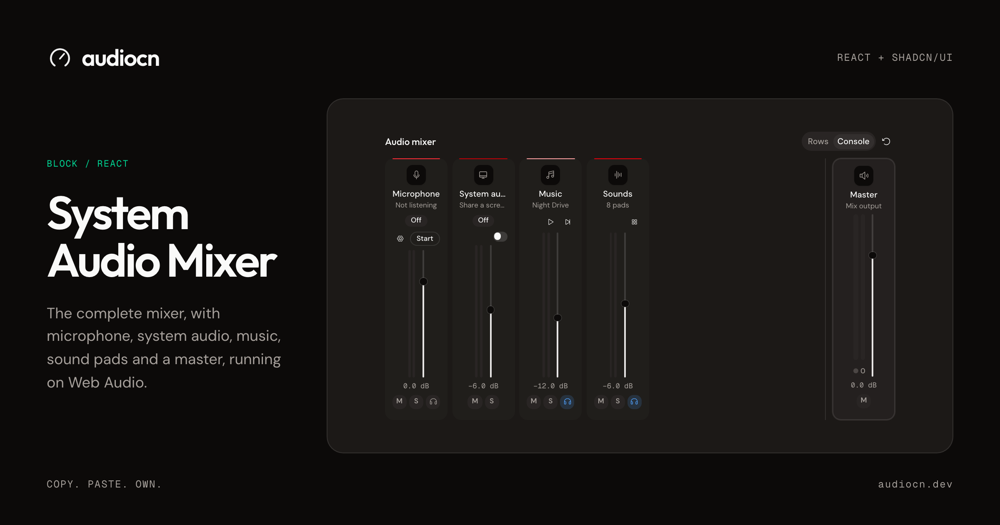</a></td>
    <td width="50%"><a href="https://audiocn.dev/docs/blocks/music-player">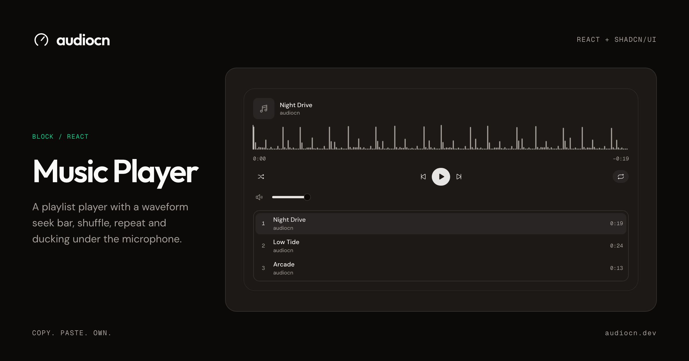</a></td>
  </tr>
  <tr>
    <td width="50%"><a href="https://audiocn.dev/docs/blocks/soundboard">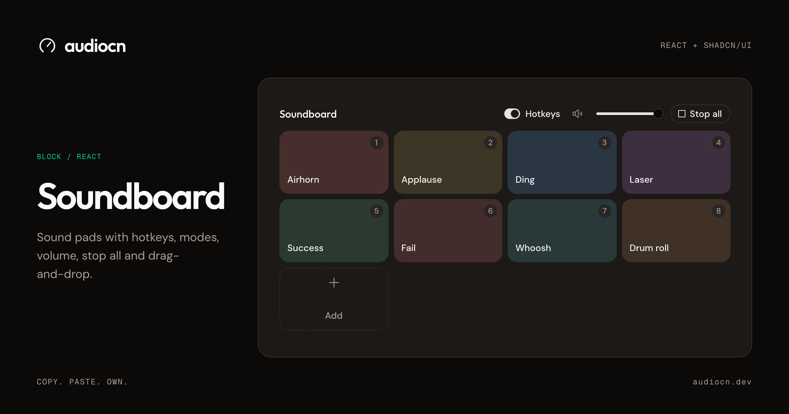</a></td>
    <td width="50%"><a href="https://audiocn.dev/docs/blocks/mic-setup">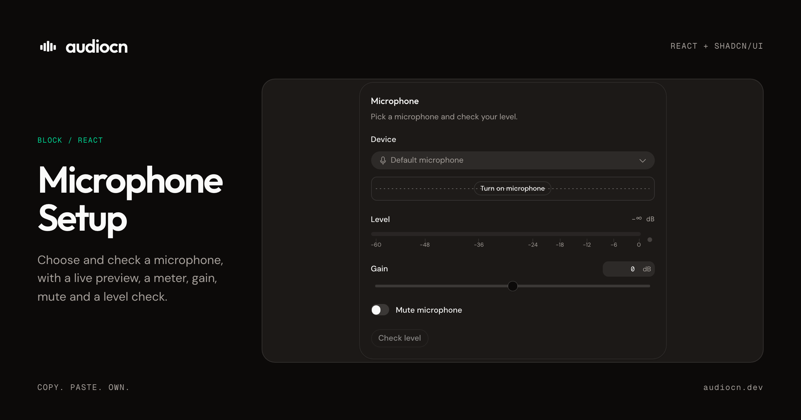</a></td>
  </tr>
  <tr>
    <td width="50%"><a href="https://audiocn.dev/docs/blocks/quick-audio-popover">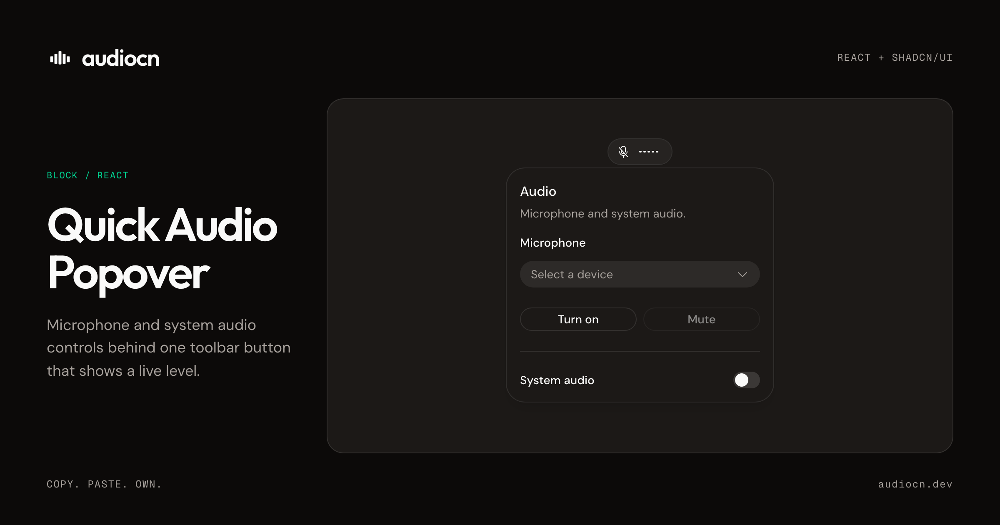</a></td>
    <td width="50%"><a href="https://audiocn.dev/docs/blocks/system-audio-settings">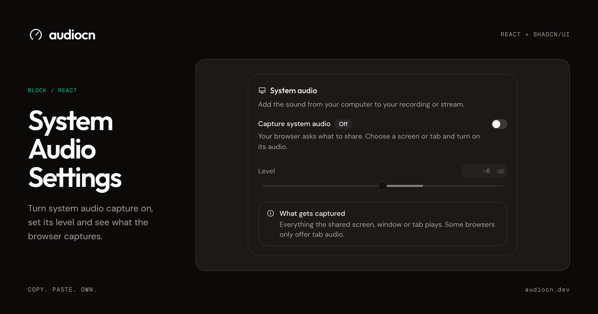</a></td>
  </tr>
</table>

## Hooks

Web Audio plumbing so the components have something to show. Use them, or feed the components from your own engine.

| Hook | What it does |
| --- | --- |
| [`useMicrophone`](https://audiocn.dev/docs/hooks/use-microphone) | Open a microphone as a `MediaStream`, with browser processing off by default |
| [`useSystemAudio`](https://audiocn.dev/docs/hooks/use-system-audio) | Capture system or tab audio through the browser's screen-share picker |
| [`useAudioAnalyser`](https://audiocn.dev/docs/hooks/use-audio-analyser) | Meter and visual frame sources from a stream, media element or `AudioNode` |
| [`useWebAudioMixer`](https://audiocn.dev/docs/hooks/use-web-audio-mixer) | Bind mixer state to a Web Audio graph, with ducking, monitor sends and a limited master |
| [`useMixer`](https://audiocn.dev/docs/hooks/use-mixer) | Gain, mute, solo, pan and monitor per channel, plus a master, with no audio attached |
| [`useAudioPlayer`](https://audiocn.dev/docs/hooks/use-audio-player) | Playback state for an audio element the hook owns |
| [`useSound`](https://audiocn.dev/docs/hooks/use-sound) | Low-latency playback of short sounds decoded into memory |
| [`useWaveformData`](https://audiocn.dev/docs/hooks/use-waveform-data) | Decode an audio file and reduce it to cached waveform peaks |
| [`useAudioDevices`](https://audiocn.dev/docs/hooks/use-audio-devices) | Audio input or output devices, with permission state and live updates |
| [`useDemoSignal`](https://audiocn.dev/docs/hooks/use-demo-signal) | Synthetic speech, music, tone or noise, for previews, prototypes and tests |

Plus `useAudioContext`, `useFrameSource`, `useLevel`, `useClipHold`, `useReducedMotion` and `useAudioConfig`.

## Quick start

audiocn is a [shadcn registry](https://ui.shadcn.com/docs/registry). You need React 19.2 or later, Tailwind CSS v4 and a project set up with shadcn/ui.

**1. Add the registry** to `components.json`:

```json
{
  "registries": {
    "@audiocn": "https://audiocn.dev/r/{name}.json"
  }
}
```

**2. Add components.** The CLI copies each one with everything it depends on: the audio core, the audio theme tokens and any hooks it uses.

```bash
npx shadcn@latest add @audiocn/level-meter
npx shadcn@latest add @audiocn/system-audio-mixer
```

**3. Use them.**

```tsx
import { LevelMeter } from "@/components/ui/level-meter";

export const MicLevel = ({ peakDb }: { peakDb: number }) => (
  <LevelMeter aria-label="Microphone level" peakDb={peakDb} />
);
```

Full guide: [audiocn.dev/docs/installation](https://audiocn.dev/docs/installation).

## Develop

This repository is the docs site, the registry source and the component source in one Next.js app.

| Path | What it is |
| --- | --- |
| `components/ui/` | Components (audiocn's and the shadcn ones the site uses) |
| `components/blocks/` | Blocks |
| `hooks/` | Hooks |
| `lib/audio/` | The audio core |
| `components/examples/` | Docs previews |
| `content/docs/` | Docs pages (Fumadocs MDX) |
| `registry.json` | The registry; `pnpm registry:build` writes `public/r/` |
| `plans/` | The plan and component specs |

```bash
pnpm install
pnpm dev              # docs site on http://localhost:3000
pnpm test             # unit and component tests (Vitest)
pnpm test:e2e         # browser tests (Playwright)
pnpm test:install     # installs every registry item into a fresh app and type-checks it
pnpm typecheck
pnpm check            # lint and format check (Ultracite)
pnpm build            # examples, registry and site
pnpm og:build         # regenerate the social cards in public/og/
```

The screenshots in this README are the social cards captured at 2x into `.github/readme/`.

## Licence

[MIT](./license.md)

---

<p align="center">Built by <a href="https://x.com/fortysevenfx">fortysevenfx</a> and <a href="https://x.com/orcdev">orcdev</a> with 🪓🪓</p>
